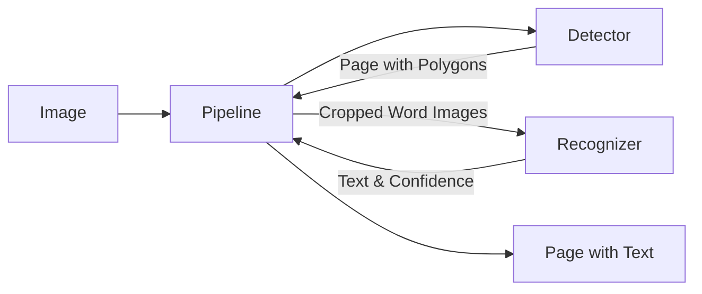

# System Architecture

## High-Level Overview

The `manuscript-ocr` library follows a modular pipeline architecture. The central component is the `Pipeline` class, which orchestrates the flow of data between a Text Detector and a Text Recognizer.

## Key Components

### 1. Pipeline (`src/manuscript/_pipeline.py`)
- **Responsibility:** Coordinator. Manages the end-to-end process.
- **Workflow:**
    1.  Receives an image.
    2.  Calls the Detector to find text regions (`Page` object with `Block`s and `Word`s).
    3.  (Optional) Sorts boxes in reading order.
    4.  Extracts (crops) images of words based on detected polygons.
    5.  Calls the Recognizer to transcribe text from these crops.
    6.  Populates the `Page` object with recognized text and confidence scores.
    7.  Returns the fully annotated `Page` object.

### 2. Text Detector (`src/manuscript/detectors/`)
- **Default Implementation:** `EAST` (Efficient and Accurate Scene Text Detector).
- **Path:** `src/manuscript/detectors/_east/`
- **Interface:** `predict(image, vis=False, profile=False) -> Page`
- **Output:** Returns a `Page` object containing `Block`s and `Word`s. Each `Word` has a `polygon` (4 points) and `detection_confidence`.
- **Key Logic:**
    -   Image preprocessing (resize, normalization).
    -   Model inference (UNet-like architecture).
    -   Post-processing (Locality-Aware NMS, geometry restoration) to convert probability maps to polygons.

### 3. Text Recognizer (`src/manuscript/recognizers/`)
- **Default Implementation:** `TRBA` (TPS-ResNet-BiLSTM-Attention).
- **Path:** `src/manuscript/recognizers/_trba/`
- **Interface:** `predict(images: List[np.ndarray]) -> List[Dict]`
- **Input:** A list of cropped word images (numpy arrays).
- **Output:** A list of dictionaries `{'text': str, 'confidence': float}`.
- **Key Logic:**
    -   Image rectification (TPS).
    -   Feature extraction (ResNet).
    -   Sequence modeling (BiLSTM).
    -   Prediction (Attention-based decoder).

### 4. Data Structures (`src/manuscript/detectors/_types.py`)
-   **Page:** Represents a document page. Contains a list of blocks.
-   **Block:** Represents a logical block of text. Contains a list of words.
-   **Word:** Represents a single word/token. Contains `polygon`, `detection_confidence`, `text`, `recognition_confidence`.

## Design Patterns
-   **Strategy Pattern:** The `Pipeline` can be injected with different implementations of detectors and recognizers, provided they adhere to the implicit interface (duck typing).
-   **Data Transfer Object (DTO):** The `Page`, `Block`, and `Word` classes act as DTOs to pass structured data between components.

## Critical Paths
-   **Inference:** `Pipeline.predict` -> `Detector.predict` -> `Pipeline._extract_word_image` -> `Recognizer.predict`.
-   **Training:** Separate training scripts/methods for EAST and TRBA allow fine-tuning on custom datasets.