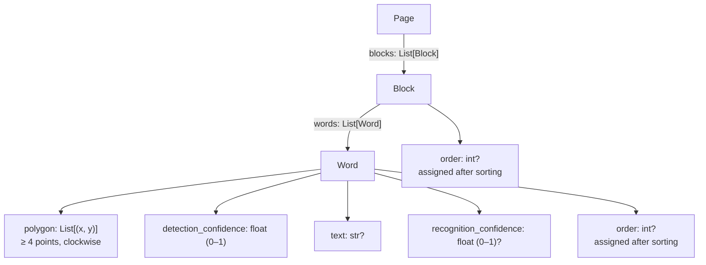

```mermaid
graph TD

    %% Entities
    Page[Page]
    Block[Block]
    Word[Word]

    %% Relations
    Page -->|"blocks: List[Block]"| Block
    Block -->|"words: List[Word]"| Word

    %% Word fields
    Word --> Wpoly["polygon: List[(x, y)]<br>≥ 4 points, clockwise"]
    Word --> Wdet["detection_confidence: float (0–1)"]
    Word --> Wtext["text: str?"]
    Word --> Wrec["recognition_confidence: float (0–1)?"]
    Word --> WordOrder["order: int?<br>assigned after sorting"]

    %% Block fields
    Block --> BlockOrder["order: int?<br>assigned after sorting"]
```