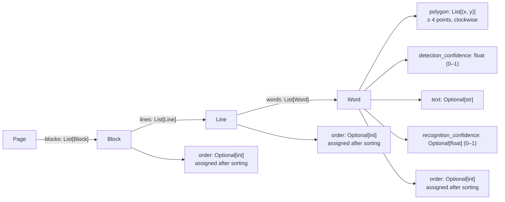

# API Совместимость для Pipeline

Pipeline в `manuscript-ocr` спроектирован для работы с **любыми** детекторами и распознавателями, реализующими простой интерфейс.

---

## Требования к Детектору

Класс детектора должен реализовать метод `predict`, который принимает изображение и возвращает словарь с ключом `"page"`:

```python
def predict(self, image) -> Dict[str, Any]:
    """
    Параметры:
    - image: путь к файлу (str) или numpy массив (H, W, 3) в uint8
    
    Возвращает словарь:
    {
        "page": Page  # объект Page с результатами детекции
    }
    """
    pass
```

### Структура результата

Результат должен содержать объект `Page` с иерархией:  
**Page** → **Block** → **Line** → **Word**



Подробное описание структур данных смотрите в `src/manuscript/data/structures.py`.

**Минимальный пример создания Page:**

```python
from manuscript.data import Word, Line, Block, Page

# Создаем слово с координатами и уверенностью детекции
word = Word(
    polygon=[(10, 20), (100, 20), (100, 40), (10, 40)],
    detection_confidence=0.95
)

# Группируем слова в строку
line = Line(words=[word])

# Группируем строки в блок
block = Block(lines=[line])

# Создаем страницу
page = Page(blocks=[block])
```

---

## Требования к Распознавателю

Класс распознавателя должен реализовать метод `predict`, который принимает список изображений и возвращает список результатов:

```python
def predict(self, images: List[np.ndarray]) -> List[Dict[str, Any]]:
    """
    Параметры:
    - images: список numpy массивов (RGB изображения слов)
    
    Возвращает список словарей:
    [
        {"text": "слово1", "confidence": 0.95},
        {"text": "слово2", "confidence": 0.92},
        ...
    ]
    """
    pass
```

**Пример:**

```python
class MyRecognizer:
    def predict(self, images):
        results = []
        for img in images:
            # Ваша логика распознавания
            text = "распознанный_текст"
            confidence = 0.92
            results.append({"text": text, "confidence": confidence})
        return results
```

---

## Примеры совместимых реализаций

### Полный пример детектора

```python
from manuscript.data import Word, Line, Block, Page

class MyDetector:
    def predict(self, image):
        # Ваша логика детекции изображения
        # ...
        
        # Создаем результат
        words = [
            Word(
                polygon=[(10, 20), (100, 20), (100, 40), (10, 40)],
                detection_confidence=0.95
            ),
            Word(
                polygon=[(110, 20), (200, 20), (200, 40), (110, 40)],
                detection_confidence=0.92
            ),
        ]
        
        line = Line(words=words)
        block = Block(lines=[line])
        page = Page(blocks=[block])
        
        return {"page": page}
```

### Полный пример распознавателя

```python
class MyRecognizer:
    def predict(self, images):
        results = []
        for img in images:
            # Ваша логика распознавания
            text = "распознанный_текст"
            confidence = 0.92
            results.append({"text": text, "confidence": confidence})
        return results
```

### Использование с Pipeline

```python
from manuscript import Pipeline

# С моделями по умолчанию (EAST + TRBA)
pipeline = Pipeline()
result = pipeline.predict("image.jpg")
text = pipeline.get_text(result["page"])

# С пользовательскими компонентами
detector = MyDetector()
recognizer = MyRecognizer()
pipeline = Pipeline(detector, recognizer)
result = pipeline.predict("image.jpg")
```
```

---

## Использование Pipeline

### Базовое использование

```python
from manuscript import Pipeline

# Инициализация с моделями по умолчанию
pipeline = Pipeline()

# Распознавание изображения
result = pipeline.predict("document.jpg")
page = result["page"]

# Извлечение текста
text = pipeline.get_text(page)
print(text)
```

### Только детекция (без распознавания)

```python
result = pipeline.predict("document.jpg", recognize_text=False)
page = result["page"]

# Слова имеют polygon и detection_confidence, но без text
for block in page.blocks:
    for line in block.lines:
        for word in line.words:
            print(f"Polygon: {word.polygon}, Confidence: {word.detection_confidence}")
```

### С визуализацией

```python
result, vis_img = pipeline.predict("document.jpg", vis=True)
vis_img.save("output_visualization.jpg")
```

### С профилированием

```python
# Выводит время выполнения каждого этапа
result = pipeline.predict("document.jpg", profile=True)
# Вывод:
# Detection: 0.123s
# Load image for crops: 0.005s
# Extract 45 crops: 0.012s
# Recognition: 0.234s
# Pipeline total: 0.374s
```

### Пакетная обработка

```python
images = ["page1.jpg", "page2.jpg", "page3.jpg"]
results = pipeline.process_batch(images)

for result in results:
    text = pipeline.get_text(result["page"])
    print(text)
```

---

## Настройка компонентов

### Замена детектора или распознавателя

```python
from manuscript import Pipeline

# Только кастомный детектор, распознаватель по умолчанию
from my_package import MyCustomDetector
pipeline = Pipeline(detector=MyCustomDetector())

# Только кастомный распознаватель, детектор по умолчанию  
from my_package import MyCustomRecognizer
pipeline = Pipeline(recognizer=MyCustomRecognizer())

# Оба компонента кастомные
pipeline = Pipeline(detector=MyCustomDetector(), recognizer=MyCustomRecognizer())
```

### Настройка встроенных моделей

```python
from manuscript import Pipeline
from manuscript.detectors import EAST
from manuscript.recognizers import TRBA

# EAST с настройками
detector = EAST(
    weights="east_50_g1",        # выбор весов
    score_thresh=0.8,            # порог уверенности
    nms_thresh=0.2,              # порог NMS
    device="cpu"                 # устройство (cpu/cuda)
)

# TRBA с настройками
recognizer = TRBA(
    weights="trba_lite_g1",      # выбор весов
    device="cuda"                # GPU для ускорения
)

pipeline = Pipeline(detector, recognizer)
```

### Фильтрация по размеру

```python
# Игнорировать текстовые блоки меньше 10 пикселей
pipeline = Pipeline(min_text_size=10)
```

---